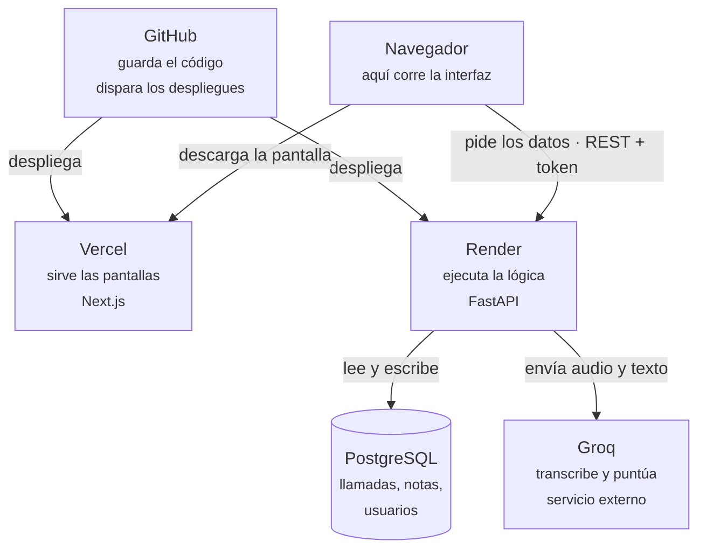

# Arquitectura, en lenguaje normal

> Para entender cómo está construida la aplicación sin saber programar.
> El detalle técnico para desarrolladores está en [`AGENTS.md`](AGENTS.md).

**Versión visual:** <https://claude.ai/code/artifact/1e9ed3de-cb74-43b0-a49a-c9b3a87c4e02>

---

## En una frase

Un jefe de campaña sube grabaciones de llamadas de venta. La aplicación las transcribe, las
evalúa contra una rúbrica de siete criterios y devuelve una nota del 0 al 100 con
recomendaciones concretas. Antes eso lo hacía una persona escuchando llamada por llamada.

## Las cifras

| | |
|---|---|
| Programas | 2 (frontend + backend) |
| Líneas de código | 20.213 |
| Funciones de la API | 54 |
| Tablas de datos | 10 |
| Pruebas automáticas | 147 |
| Coste mensual | $0 |

---

## Dos programas que se hablan

Toda la aplicación son **dos programas separados** que se comunican por internet. Todo lo
demás es consecuencia de eso.

### El frontend — lo que ves

Todo lo visual: el login, el panel, las gráficas, el reproductor de audio. **Se ejecuta dentro
del navegador** de quien usa la app. No guarda nada: cada dato que muestra se lo pide al
backend.

| | |
|---|---|
| Lenguaje | TypeScript |
| Framework | Next.js 14 (sobre React 18) |
| Estilos | Tailwind CSS |
| Gráficas | Recharts |
| Alojado en | Vercel |
| Tamaño | 9.012 líneas · 50 archivos |

### El backend — lo que decide

Las reglas y los datos: quién puede ver qué, cómo se calcula una nota, dónde se guarda cada
llamada, cuándo se llama a la IA. **Se ejecuta en un servidor**, nunca en el navegador.

| | |
|---|---|
| Lenguaje | Python 3.11 |
| Framework | FastAPI |
| Base de datos | PostgreSQL, vía SQLAlchemy |
| Seguridad | JWT (sesiones) + bcrypt (contraseñas) |
| Alojado en | Render, dentro de un contenedor Docker |
| Tamaño | 11.201 líneas · 87 archivos |

---

## El mapa



La única pieza que **no controlas** es Groq. Ya ha dado dos sustos: una clave caducada y la
retirada de un modelo sin aviso.

---

## El viaje de una llamada

| | Paso | Dónde ocurre |
|---|---|---|
| 1 | El jefe sube el audio | Navegador |
| 2 | La API guarda el archivo y crea la ficha | Render |
| 3 | **Whisper transcribe el audio a texto** | **Groq** |
| 4 | Se enmascaran los datos personales (DNI, tarjetas) | Render |
| 5 | **El modelo de lenguaje puntúa contra la rúbrica** | **Groq** |
| 6 | El jefe ve la nota y las recomendaciones | Navegador |

Los pasos **3 y 5** son los únicos que salen de tu infraestructura. El audio original sale
entero; el texto sale con los datos personales ya enmascarados. Es justo el punto que
Compliance tendrá que aprobar antes de usar grabaciones reales — ver
[`COMPLIANCE_CHECKLIST.md`](COMPLIANCE_CHECKLIST.md).

---

## Lo que hace distinta a la aplicación: calibrar

Que una IA puntúe llamadas es el punto de partida, no el producto. La pregunta que
sigue —y que casi nadie responde— es **¿y quién dice que la IA puntúa bien?**

Aquí eso se responde midiéndolo:

| | Qué pasa | Dónde queda |
|---|---|---|
| 1 | La IA puntúa la llamada | Tabla `analyses` |
| 2 | El jefe la puntúa **sin ver la nota de la IA** | Tabla `reviews` |
| 3 | Se comparan las dos, dimensión a dimensión | Panel de acuerdo |
| 4 | El asesor responde y puede pedir revisión | Tabla `acknowledgements` |

**Las dos notas conviven; la de la IA no se sobrescribe nunca.** Es la condición para
que el paso 3 sea posible: si el humano pisara la nota, a la semana siguiente nadie
podría decir en qué criterios discrepan.

La sesión del paso 2 es ciega **en el servidor**: el endpoint que sirve la llamada no
incluye el análisis, así que el score ni siquiera llega al navegador. Ocultarlo en la
interfaz no serviría — estaría a un clic en las herramientas de desarrollo.

Y lo que sale del paso 3 no es una nota más, sino un diagnóstico de la **rúbrica**: si
un criterio concreto discrepa mucho más que los demás, lo normal no es que la IA falle,
sino que ese criterio esté redactado de forma que admite dos lecturas. El panel lo
señala y enlaza a la pantalla donde reescribirlo.

---

## Dónde está alojado cada cosa y por qué

| Servicio | Qué hace aquí | Por qué ese |
|---|---|---|
| **GitHub** | Guarda el código y su historia. Ejecuta la vigilancia y las copias. | Es el estándar. Vercel y Render se conectan y despliegan solos con cada cambio. |
| **Vercel** | Publica el frontend. | Lo hacen los mismos que hacen Next.js: se despliega sin configurar nada. |
| **Render** | Ejecuta la API y aloja la base de datos. | Vercel no sirve: hace falta un proceso Python encendido de forma continua. |
| **PostgreSQL** | Guarda usuarios, llamadas, transcripciones y notas. | Base de datos relacional estándar, incluida en Render. |
| **Groq** | Transcribe y puntúa. | Gratis y muy rápido. Se puede cambiar a Claude, OpenAI o Azure con una variable. |
| **Docker** | Levanta una copia completa en tu ordenador. | Empaqueta la app con todo lo que necesita: funciona igual en tu PC que en Render. |

### El precio de que todo sea gratis

Tres consecuencias, las tres ya sufridas:

- **La base de datos caduca a los 30 días** y Render la borra con todo dentro.
- **El servidor se duerme** tras 15 min sin uso: la primera visita tarda ~50 segundos.
- **Los audios subidos se borran** en cada despliegue.

Pasar Render a plan de pago resuelve las tres. Ver decisión **D-1** en
[`ACUERDOS.md`](ACUERDOS.md).

---

## Ocho palabras y entiendes cualquier conversación

| Palabra | Qué es |
|---|---|
| **Frontend** | La parte que se ve y se toca. Vive en el navegador. |
| **Backend** | La parte que decide y recuerda. Vive en un servidor. Nadie la ve. |
| **Framework** | Un esqueleto con las piezas comunes ya resueltas, para no escribir todo desde cero. Next.js es el del frontend; FastAPI el del backend. |
| **API** | El menú de cosas que el backend sabe hacer. El frontend pide por ese menú. Aquí hay 54 platos. |
| **Endpoint** | Cada plato concreto. `/calls/12/audio` devuelve el audio de la llamada 12. |
| **Base de datos** | El archivador. Diez tablas: usuarios, llamadas, transcripciones… |
| **Migración** | Una instrucción para cambiar la forma del archivador sin perder lo guardado. Aquí van diez, numeradas. |
| **Despliegue** | Publicar una versión nueva. Aquí ocurre solo: subes el cambio a GitHub y en dos minutos está en vivo. |

---

## Qué hay dentro de cada carpeta

```
backend/          Python — la lógica y los datos
  app/routers/    Las 54 funciones de la API, agrupadas por tema
  app/services/   Las reglas de negocio (analizar, transcribir, puntuar, calibrar)
  app/models/     Las 10 tablas de la base de datos
  alembic/        Las 10 migraciones, en orden
  tests/          Las 147 pruebas automáticas

frontend/         TypeScript — lo que se ve
  app/            Una carpeta por pantalla (dashboard, llamadas, campañas…)
  components/     Piezas reutilizables (botones, tarjetas, gráficas)
  lib/            Conexión con la API y estado de la sesión

docs/             Toda la documentación
.github/          Vigilancia y copias de seguridad automáticas
```

---

## Para seguir leyendo

- **[`ACUERDOS.md`](ACUERDOS.md)** — qué decidimos, por qué, y qué costaría cambiarlo.
- **[`HISTORIA.md`](HISTORIA.md)** — de dónde viene el proyecto, en orden.
- **[`BRAND.md`](BRAND.md)** — la identidad visual.
- **[`AGENTS.md`](AGENTS.md)** — el detalle técnico, para quien vaya a tocar el código.
